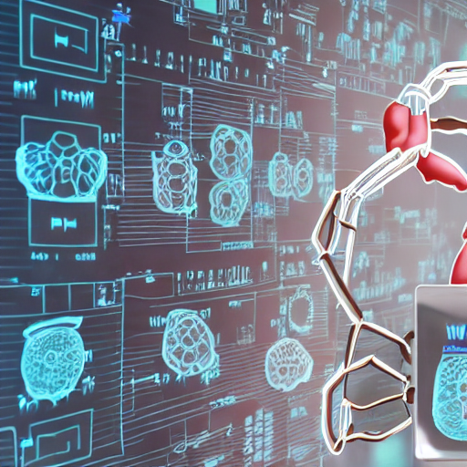

# MultiFusion

基于 **IRENE** 改造的四模态心脏磁共振（CMR）融合与年龄回归研究代码。

本项目继承 IRENE 将不同模态统一表示为 token 序列，并通过 Transformer 渐进融合的核心思想，在此基础上针对 CMR 数据重新设计。当前任务不是原始 IRENE 的胸部影像/临床信息疾病分类，而是融合 SA、LA、T1 和 Aortic 四种 CMR 模态预测受试者的 `age_at_scan`。

> IRENE: Zhou et al., *A transformer-based representation-learning model with unified processing of multimodal input for clinical diagnostics*, Nature Biomedical Engineering, 2023. [论文链接](https://www.nature.com/articles/s41551-023-01045-x)

## 与原始 IRENE 的关系

本仓库是在 IRENE 代码和模型思想基础上的研究性改造，主要变化包括：

- 将原始多模态疾病分类改为四模态 CMR 年龄回归。
- 将四种 CMR 输入统一为每模态 256 个、每个 1024 维的 token。
- 支持真实缺失模态和训练阶段的 modality dropout。
- 前两层使用分模态 cross-attention，后十层拼接全部 token 统一编码。
- 新增 Local Inter-modal Alignment（LIA）辅助损失。
- 增加从原始 CMR NPZ 数据出发的 ViTa/DINOv2 端到端训练流程。
- 使用归一化年龄损失，并在真实年龄尺度报告 MAE、RMSE、R² 和 Pearson r。

本仓库不是 IRENE 官方代码的原样镜像，也不提供原始 IRENE 权重或本项目使用的医学数据。

## 输入模态

| 名称 | 数据类型 | 端到端 backbone |
| --- | --- | --- |
| SA | Short-axis cine CMR | ViTa |
| LA | Long-axis 4-chamber cine CMR | ViTa |
| T1 | ShMOLLI T1 mapping | DINOv2 |
| Aortic / AO | Aortic cine CMR | DINOv2 |

## 两条训练流程

### 1. 预提取 Token 训练

```text
4 × [B, 256, 1024]
        ↓
modality-specific projection + CLS + position embedding
        ↓
2 layers cross-modal Transformer
        ↓
concatenate to [B, 1028, 768]
        ↓
10 layers shared Transformer
        ↓
masked mean pooling + regression head
        ↓
normalized age prediction
```

主要文件：

- `train.py`：训练和验证。
- `eval.py`：加载 checkpoint，在指定 split 上评估。
- `data/cmr_dataset.py`：token 读取、缺失模态和 modality dropout。
- `models/modeling_irene.py`：CMR IRENE 主模型。
- `models/local_alignment.py`：LIA 辅助损失。

### 2. 原始图像端到端训练

`late_gated/` 是历史目录名；当前实现不是简单 late-gated baseline，而是完整的端到端 IRENE token fusion：

```text
SA / LA raw CMR ── ViTa ───┐
                            ├─ TokenReducer ─ CMRIrene ─ age
T1 / AO raw CMR ── DINOv2 ─┘
                     └──────── deep-supervision heads
```

主要文件：

- `late_gated/train_end2end.py`：支持 DDP、AMP、early stopping 和 resume。
- `late_gated/eval_end2end.py`：端到端 checkpoint 评估。
- `late_gated/dataset.py`：原始 NPZ 读取和四模态预处理。
- `late_gated/model_end2end.py`：backbone、TokenReducer 和 CMRIrene 融合。

端到端总损失：

```text
loss = loss_reg + lambda_lia × loss_lia + lambda_aux × loss_aux
```

## 默认模型配置

- Hidden size：768
- 每模态 token 数：256
- 输入 token 维度：1024
- 模态数量：4
- Transformer layers：12
- Cross-modal layers：2
- Attention heads：12
- MLP dimension：3072
- Modality dropout：0.1
- `lambda_lia`：0.1
- LIA temperature：0.1

## 数据和路径

代码当前针对内部集群环境开发，默认数据根目录为：

```text
/mnt/shared-storage-gpfs2/gpfs-aging/cmr_tmp
```

Token-only 流程依赖：

- `data/metadata/unified_split.json`
- `UKB_processed/age_at_scan_wide.csv`
- `token_embeddings/sa`
- `token_embeddings/la_4ch`
- `token_embeddings/t1`
- `token_embeddings/aortic`

端到端流程还依赖四个 visit1-only split、ViTa 源码、DINOv2 权重和四个单模态 checkpoint。这些数据、权重和外部项目不包含在本仓库中。

## 环境

建议环境：

- Python 3.10+
- PyTorch 2.x
- CUDA GPU
- NumPy、torchvision、tqdm
- transformers、safetensors

端到端训练还需要项目外部的 ViTa 和 `multimode_train` 模块，具体环境应与内部训练镜像保持一致。

## 运行

GitHub 仓库名称为 `multifusion`，但源码暂时保留内部集群的 Python 包路径 `multi_fusion.cmr_irene_v7`：

```bash
cd /mnt/shared-storage-gpfs2/gpfs-aging/cmr_tmp

# Token-only training
python -m multi_fusion.cmr_irene_v7.train \
  --out_dir outputs/cmr_irene_v7 \
  --epochs 30 \
  --batch_size 64

# Token-only evaluation
python -m multi_fusion.cmr_irene_v7.eval \
  --ckpt outputs/cmr_irene_v7/checkpoints/best_model.pth \
  --split test

# End-to-end training
python -m multi_fusion.cmr_irene_v7.late_gated.train_end2end \
  --out_dir outputs/cmr_irene_v7_end2end \
  --epochs 30
```

也可以使用根目录和 `late_gated/` 下的 rjob 集群作业脚本。

## 输出

```text
outputs/<experiment>/
├── checkpoints/
│   ├── best_model.pth
│   ├── last_model.pth
│   └── resume_state.pth
└── logs/
    ├── startup_metrics.json
    └── epoch_metrics.jsonl
```

`startup_metrics.json` 保存年龄归一化、输入 shape、训练策略和 LIA 配置，评估时需要与 checkpoint 一起保留。

## 历史文件

根目录的 `irene.py` 和 `run.sh` 来自原始 IRENE 分类代码，仅用于保留上游历史，不属于当前 CMR 年龄回归训练链路。

## Citation

如果本项目或其中的 IRENE 部分对研究有帮助，请引用原始论文：

```bibtex
@article{zhou2023irene,
  title={A transformer-based representation-learning model with unified processing of multimodal input for clinical diagnostics},
  author={Zhou, Hong-Yu and Yu, Yizhou and Wang, Chengdi and Zhang, Shu and Gao, Yuanxu and Pan, Jia and Shao, Jun and Lu, Guangming and Zhang, Kang and Li, Weimin},
  journal={Nature Biomedical Engineering},
  year={2023},
  doi={10.1038/s41551-023-01045-x},
  publisher={Nature Publishing Group UK London}
}
```

## License

本仓库沿用 [LICENSE](LICENSE) 中的 MIT License。使用和再分发时还需遵守外部 backbone、模型权重及医学数据各自的许可和数据治理要求。
